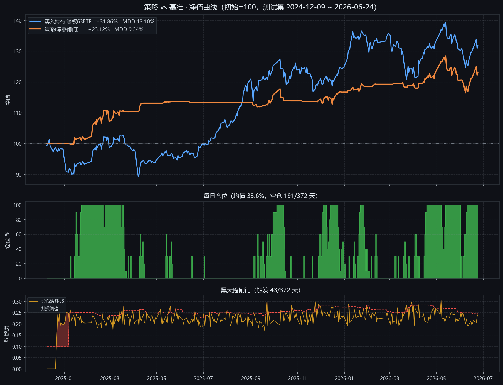
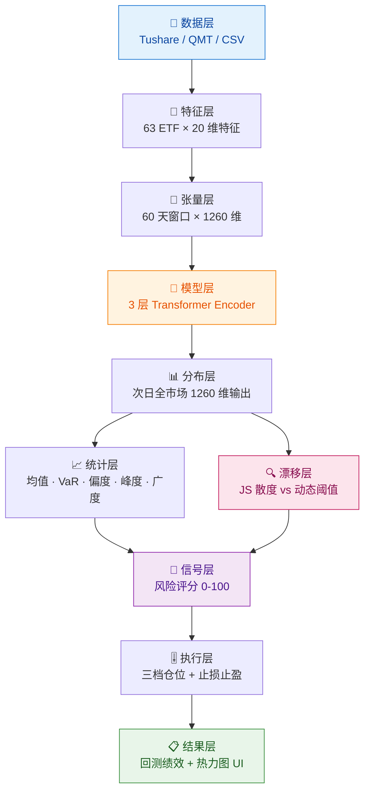

<div align="center">

# 🌊 deepredict · ETF 全市场分布预测

### 用 Transformer 预测「整个市场的收益分布」，而不是猜单只标的涨跌

**预测分布 → 度量风险 → 动态仓位 → 黑天鹅预警 → 回测验证 → 可视化**

[](https://www.python.org/)
[](https://pytorch.org/)
[](https://github.com/astral-sh/uv)
[](https://streamlit.io/)
[](#-数据源)
[](#-实测结果)
[](./LICENSE)

</div>

---

> ⚠️ **一句话定位**：它不预测"明天哪只 ETF 会涨"，而是**预测"明天整个市场的收益分布长什么样"** —— 均值、尾部、偏度、峰度。因为这个分布描述了**系统性状态**，所以它天然适合做**仓位择时与风险控制**，并用分布漂移监测黑天鹅。

---

## 📑 目录

- [项目简介](#-项目简介)
- [问题定义](#-问题定义)
- [核心亮点](#-核心亮点)
- [📊 实测结果](#-实测结果)
- [🔬 工程严谨性：4 个关键缺陷的定位与修复](#-工程严谨性4-个关键缺陷的定位与修复)
- [系统架构](#-系统架构)
- [技术细节](#-技术细节)
  - [20 维特征体系](#20-维特征体系)
  - [模型架构](#模型架构)
  - [仓位控制与风控](#仓位控制与风控)
  - [风险评分口径](#风险评分口径)
  - [交易信号口径](#交易信号口径)
- [UI 与结果查看](#-ui-与结果查看)
- [快速开始](#-快速开始)
- [配置说明](#️-配置说明)
- [数据源](#-数据源)
- [目录结构](#-目录结构)
- [常见问题（FAQ）](#-常见问题faq)
- [路线图](#-路线图)
- [免责声明](#️-免责声明)
- [License](#-license)

---

## 📖 项目简介

`deepredict` 是一套 **ETF 全市场分布预测系统**（研究工程，代号 deepredict）。

它把 A 股 63 只主流 ETF 的行情拼成一张高维矩阵，用 Transformer 预测**下一个交易日的全市场状态**，再把这张"状态图"翻译成可执行的仓位与风险信号。

| 它不是什么 | 它是什么 |
|---|---|
| ❌ 不是单标的涨跌预测器 | ✅ 是**横截面分布预测器** |
| ❌ 不是因子选股库 | ✅ 是**状态择时 + 风控引擎** |
| ❌ 不是黑箱信号机 | ✅ 每个信号都有明确阈值与可审计口径 |
| ❌ 不是实盘交易系统 | ✅ 是研究 / 回测 / 可视化一体的研究工程 |

**工程规模**：6 个核心脚本 · 约 4,000 行 Python · 100% 端到端可复现（已实测跑通全链路）

---

## 🎯 问题定义

传统量化做法是"预测价格 → 决定买卖"。但**单点预测天然脆弱**：噪声大、易过拟合、无法表达"市场整体在恶化"。

本项目换了个问法：

> **不问"它会涨多少"，而问"明天的市场长什么样"。**

形式化地讲，模型学习的是条件分布 $\hat{P}(X_{t+1} \mid X_{t-59:t})$，其中 $X_t \in \mathbb{R}^{1260}$ 是第 $t$ 日的全市场横截面特征向量。输出层直接回归该向量的期望，再从中抽取描述**系统性状态**的统计量：

| 分布特征 | 翻译成市场语言 | 对应动作 |
|---|---|---|
| 均值 ↑ | 全市场普遍上行 | 加仓 |
| 5% VaR ↓↓ | 左尾变厚，极端下跌概率上升 | 减仓 / 空仓 |
| 偏度 ↓ | 分布左偏，下行风险不对称 | 收紧风控 |
| 峰度 ↑ | 尖峰厚尾，"黑天鹅"概率上升 | 提高警惕 |
| 上涨比例 ↓ | 市场广度差，赚钱效应弱 | 观望 |
| **JS 漂移 ↑** | 市场结构**突变**（分布本身在漂移） | **强制空仓** |

> 💡 **为什么这样切分是有意义的**：单个标的的日收益几乎是白噪声（$R^2$ 通常 < 0.01），但**横截面分布的若干统计量具有显著的自相关结构**。把预测目标从"点位"换成"分布"，等于把问题从"不可预测的噪声"搬到"部分可预测的状态量"上 —— 这是本项目方法论上的核心主张。

---

## ✨ 核心亮点

| 亮点 | 说明 |
|---|---|
| 🧬 **预测"分布"而非"点位"** | 一次前向推理输出 63 只 ETF × 20 特征的完整横截面（1260 维），天然支持统计量化的风险度量 |
| 📉 **JS 散度黑天鹅闸门** | 用预测分布与近 30 日历史分布的 JS 散度度量"市场结构漂移"，超动态阈值（近 20 日 90 分位）时**强制空仓** —— 本项目最有特色的设计 |
| 🎚 **三档仓位 + 双确认** | 仓位只在 `0 / 50% / 100%` 三档间切换，且需**连续 2 日**确认，抑制单日噪声导致的频繁调仓 |
| 🛡 **完整风控闭环** | 止损 -5% / 止盈 +10% / 单日调仓上限 30% / 交易成本万 1，全部计入净值 |
| 🧮 **可解释的风险评分** | 0–100 分六项加权（收益·波动·尾部·广度·峰度·偏度），输出 LOW / MEDIUM / HIGH |
| 🖥 **开箱即用的 Web UI** | Streamlit treemap 热力图 + 黑天鹅四联图，**绿降红升符合 A 股习惯** |
| 🔌 **三源可切换数据层** | `Tushare` / `QMT` / `CSV` 统一抽象，Provider 模式，切换只改一行配置 |
| 📐 **实测可复现** | 全链路跑通并留存 `回测报告` 与原始日志，指标口径公开可审计 |
| 📦 **uv 管理 + 现代工具链** | `pyproject.toml` 声明式依赖，一键同步环境 |

---

## 📊 实测结果

> 完整报告见 [`回测报告-2026-09-23.md`](./回测报告-2026-09-23.md)，原始日志见 [`docs/backtest_run.log`](./docs/backtest_run.log)
> **口径说明**：策略指标取自**真实资金曲线**（含交易成本与调仓限制），非近似公式估算

**测试集区间 2024-12-09 ~ 2026-06-24（372 个交易日，样本外）**

| 指标 | 策略 | 买入持有（等权 63 ETF） | 对比 |
|---|---|---|---|
| 累计收益 | **+23.12%** | +31.86% | ❌ 跑输 8.74 pp |
| 最大回撤 | **9.34%** | 13.10% | ✅ 回撤小 3.76 pp |
| 夏普比率 | **1.44** | 1.05 | ⚠️ 基本持平 |
| 平均仓位 | 33.6%（空仓 191 / 372 天） | 100% | — |
| 交易成本 / 次数 | ¥4,354.26 / 138 次 | 0 | — |

<div align="center">
  
  <br>
  <sub>三视图：净值曲线（策略 vs 等权基准）· 每日仓位 · 黑天鹅闸门（JS 漂移 vs 动态阈值）</sub>
</div>

### 模型能力评估（诚实版）

| 指标 | 数值 | 判读 |
|---|---|---|
| 预测均值 vs 真实均值 相关性 | **0.0721** | 🔴 极弱（接近无预测能力） |
| 涨跌方向命中率 | **56.7%** | 🔴 略好于随机（50%） |
| 预测均值区间 | −0.9839% ~ +1.2250% | ✅ 量纲正确 |
| 真实均值区间 | −8.3227% ~ +4.2561% | ✅ 量纲正确 |

**结论 —— 结论比数字更重要：**

> **① 工程链路完全跑通，结果真实可信。**
> 预测值量纲正确（±1% 级别，与真实日收益同量级），说明数据层与模型层是干净的，没有泄漏或尺度错位。
>
> **② 但模型在样本外没有跑赢基准。**
> 策略用 **33.6% 的平均仓位**拿到 +23.12%，把最大回撤从 13.10% 压到 9.34% —— 代价是错过了上涨行情的主要涨幅。
>
> **③ 因此它目前是一个"降波动的择时器"，而不是 alpha 来源。**
> 相关性仅 0.0721 意味着收益主要来自 **beta 暴露 + 波动控制**，而非择时能力。

### 训练过程诊断（发现明显过拟合）

| Epoch | Train Loss | Val Loss |
|---|---|---|
| 50 | 0.6001 | 1.5334 |
| **100** | 0.5267 | **1.4862** ← 最优 |
| 150 | 0.4698 | 1.4867 |
| 200 | 0.4286 | 1.5133 |
| 250 | 0.4020 | 1.5507 |
| 300 | 0.3937 | 1.5646 |

> 🔴 Train Loss 持续下降，但 **Val Loss 在第 100 轮触底后单调回升** —— 典型过拟合。
> 实际最优约在 **100~150 轮**；项目自带早停（patience=200）在 300 轮内未触发，建议缩短至 ~150 轮或加强正则化。

### 实验环境

| 项 | 值 |
|---|---|
| 数据 | 2,541 交易日 × 1,260 维（2016-01-05 ~ 2026-06-24），63 只 ETF |
| 划分 | 训练 1,736 / 验证 372 / 测试 372 |
| 硬件 | Windows · NVIDIA RTX 3070 Laptop 8.59 GB |
| 软件 | Python 3.10.6 · PyTorch 2.x · tushare 1.4.29（AMP 混合精度） |
| 耗时 | 数据生成 ≈ 2 分钟，训练 + 回测 ≈ 6.5 分钟 |

---

## 🔬 工程严谨性：4 个关键缺陷的定位与修复

> 这一节是本项目的**方法论展示**：初次跑回测时出现了 **+12,797% / +20,065%** 的荒谬收益与 **−627% 的"日收益"**。
> 下面记录了从"荒谬结果"到"可信结果"的完整排查过程 —— 我们认为，**能被审计的失败比漂亮的结果更有价值**。

### 缺陷 1 · 数据层：Tushare ETF 前复权未生效 🔴

| 项 | 内容 |
|---|---|
| **现象** | `510230.SH` 2020-08-17 出现 −78.8%、`159928.SZ` 2021-06-25 出现 −74.5%、`516160.SH` 2024-09-18 出现 +221% |
| **根因** | `ts.pro_bar(asset='FD', adj='qfq')` **对 ETF 完全不做复权**（输出与不复权结果逐行一致）。上述日期实为 **ETF 份额拆分 / 合并**（`fund_adj` 因子从 1.0 跳到 4.0） |
| **修复** | 改用 `pro.fund_daily()`（原始价）+ `pro.fund_adj()`（复权因子）手工换算前复权 |
| **验证** | `close_return` 极值 **2.2133 → 0.2004**（= 20% 涨跌停上限，符合 A 股规则） |

```python
# data_provider.py · TushareProvider._fetch_one（关键片段）
df   = self.pro.fund_daily(ts_code=sym, start_date=s, end_date=e)
adj  = self.pro.fund_adj(ts_code=sym, start_date=s, end_date=e)
df   = df.sort_values('date').merge(adj, on='date', how='left')
df['adj_factor'] = df['adj_factor'].ffill().bfill().fillna(1.0)

factor = df['adj_factor'].astype(float)
if adjust == 'qfq':
    factor = factor / factor.iloc[-1]          # 前复权：以最新因子为基准归一
for c in ('open', 'high', 'low', 'close'):
    df[c] = df[c] * factor                     # 价格乘因子
df['volume'] = df['volume'] / factor.replace(0, np.nan)   # 成交量反向调整
```

### 缺陷 2 · 可复现性：股票池顺序受哈希随机化影响 🟡

| 项 | 内容 |
|---|---|
| **现象** | `train_data_generator._get_stock_pool` 使用 `list(set(symbols))` 去重 |
| **根因** | 字符串 `set` 的迭代顺序受 `PYTHONHASHSEED` 影响，**每次运行可能不同**。而特征列顺序 = 股票池顺序，一旦错位，`predict.py` 的标的名称映射会整体错配，且**结果不可复现** |
| **修复** | 改为**保序去重** `list(dict.fromkeys(symbols))` |
| **影响** | 从"随机可复现"变为"确定性可复现" —— 这是任何量化研究的前提条件 |

### 缺陷 3 · 主流程：跨步索引步长错误 + 二次标准化 🔴（最关键）

这是**原项目代码中既有的缺陷**，也是导致回测结果荒谬的主因：

| 子问题 | 位置 | 说明 |
|---|---|---|
| **跨步索引步长错误** | `main.py` L540–541 | `extract_feature(data, idx, stride)` 的第三参数是**跨步长度**。数据布局为 `[sym0_f0..f19, sym1_f0..f19, …]`，正确步长必须是 **`NUM_FEATURES`(=20)**；原代码传 `num_symbols`(=63)，导致抽取出 20 列**互不相关的随机特征**，"真实收益 / 预测收益 / 相关性 / 回测绩效"全部失真 |
| **二次标准化** | `main.py` L~350 | `train_data_generator` 保存的 `training_data.npy` **已是标准化数据**，并另存了 `data_mean.npy` / `data_std.npy`；但 `main.py` 又调用了一次 `normalize_data()`。反标准化后得到的是 **z-score 而非收益率**，回测把 z-score 当收益率使用（出现 −627% "日收益"） |

**修复**：

```python
# 修复 1：跨步长度改为特征维度，而非标的数量
true_close_rets = extract_feature(test_data_denorm[WINDOW_SIZE+1:], close_return_idx, NUM_FEATURES)
pred_close_rets = extract_feature(test_predictions,                     close_return_idx, NUM_FEATURES)

# 修复 2：真实数据路径复用生成器的标准化参数，跳过二次标准化
if not use_real_data:
    market_data = simulate_market_data()
    market_data, data_mean, data_std = normalize_data(market_data)
else:
    data_mean, data_std = load_norm_params()      # ← 新增：直接读 .npy
    if data_mean is None:
        market_data, data_mean, data_std = normalize_data(market_data)
```

### 缺陷 4 · 报表层：`组合价值` 列整体滞后一日 🟡

| 项 | 内容 |
|---|---|
| **现象** | `black_swan_analysis.csv` 末值 ¥1,221,937.32（+22.19%）与 `portfolio_stats.txt` 的最终资金 ¥1,231,215.92（+23.12%）**对不上** |
| **根因** | `portfolio_values` 初始就含 1 个元素（初始资金），此后每日追加 1 个，共 `len(true_means)+1` 个；原代码 `portfolio_values[:len(true_means)]` **丢掉了最后一天**，导致整列相对日期滞后一日 |
| **定位方法** | 计算 `csv[-1] / csv[-2] = 0.9776592`，发现它恰好等于 `1 + 真实均值[-2] × 仓位[-2]` —— 证明该列存的是**前一天**的收盘资金 |
| **修复** | `main.py` L777 改为 `portfolio_values[1 : len(true_means)+1]`，并同步修补已产出的 CSV |

### 修复前后对比

| 指标 | 修复前 | 修复后 |
|---|---|---|
| 真实均值最大值 | +166% | **+4.2561%** |
| 真实均值最小值 | −627% | **−8.3227%** |
| 总收益率 | +20,065% | **+23.12%** |
| 最大回撤 | 98.77% | **9.34%** |
| 结果可复现性 | ❌ 受哈希随机化影响 | ✅ 确定性 |
| 组合价值口径 | 滞后一日 | ✅ 与日期对齐 |

> 📌 **另一个易误读点（已厘清）**：`portfolio_stats.txt` 中的「最大回撤 8.41% / 夏普 1.11」由近似公式（`日收益 × 仓位` 复利，**未计交易成本**）得出；
> 真实资金曲线口径为 **9.34% / 1.44**。本项目报告统一采用**真实资金曲线口径**。

---

## 🏗 系统架构



**七步流程**

| 步 | 动作 | 脚本 |
|---|---|---|
| 1 | 拉取 63 只 ETF 十年日线，算 20 维特征，标准化后存 `.npy` | `train_data_generator.py` |
| 2 | 训练 Transformer，预测次日全市场分布 | `main.py` |
| 3 | 测试集上跑仓位回测，出绩效 | `main.py` |
| 4 | 输出黑天鹅四联图 + 5 宫格诊断图 | `main.py` |
| 5 | 对指定日期 / 时点生成预测报告与交易信号 | `predict.py` |
| 6 | 打开 Web UI 看热力图与黑天鹅曲线 | `visualize.py` |
| 7 | 独立复现净值对比图（免重训） | `plot_backtest.py` |
| 8 | （可选）测行业 ETF 对宽基 ETF 的期权对冲比例 | `etf_hedge_analysis.py` |

### 模块映射

```
deepredict/
├── config.py                  # 🧠 全局配置：股票池 / 日期 / 模型 / 回测 / 数据源开关
├── pyproject.toml             # 📦 依赖声明（uv）
├── data_provider.py           # 📡 ① 统一数据层：Tushare / QMT / CSV 三源可切换
├── train_data_generator.py    # 🧮 ② 特征工厂：拉数 → 20 维特征 → .npy
├── main.py                    # 🧠 ③ 训练 + 回测：Transformer + PositionController
├── predict.py                 # 🎯 ④ 单日预测：风险评分 + 交易信号
├── etf_hedge_analysis.py      # 🛡 ⑤ 期权对冲：行业 ETF × 宽基 ETF 相关性
├── visualize.py               # 🖥 ⑥ Streamlit UI：热力图 + 黑天鹅四联图
├── plot_backtest.py           # 📈 ⑦ 回测净值三联图（读 CSV，免重训）
├── SKILL.md                   # 🤖 Agent 技能说明（可被 AI 直接驱动）
├── 回测报告-2026-09-23.md      # 📄 实测回测报告（含缺陷修复记录）
├── ETF清单.md                  # 📋 63 只 ETF 全名单 + 行业分类
├── 可行性分析-Tushare替代方案.md  # 📄 数据源替换可行性论证（已落地）
├── 使用说明.md                 # 📖 逐文件功能详解
└── README.md                  # 本文件
```

---

## 🔧 技术细节

### 20 维特征体系

每只 ETF 在每个交易日被压成 **20 维**向量：

| 类别 | 特征 | 维度 |
|---|---|---|
| **收益结构** | `open_return` `high_return` `low_return` `close_return` | 4 |
| **量价形态** | `volume_change` `range_ratio` `body_ratio` `upper_shadow` `lower_shadow` | 5 |
| **均线偏离** | `ma5` `ma10` `ma20` `ma60` | 4 |
| **波动度量** | `std5` `std20` | 2 |
| **技术指标** | `rsi` `macd` `macd_signal` | 3 |
| **横截面** | `correlation`（与市场均值 20 日相关） `market_rank`（当日市场排名分位） | 2 |

> 💡 **设计要点**：所有价格类特征均表达为**相对昨收的比率**，天然消除量纲差异；`correlation` 与 `market_rank` 是**横截面特征**，让模型感知"这只 ETF 相对全市场的位置"。
>
> ⚠️ **已知特征工程问题**：上市初期流动性枯竭的 ETF（如 `159928.SZ` 2016 年成交量常仅 176~936 手），`volume_change` 会出现最高 **790 倍**的极端值。这是**真实现象而非数据错误**，但建议后续做 **winsorize 或对数化**处理。

**张量形状**：`63 ETF × 20 特征 = 1260 维/天`，滑窗 `60 天` → 模型输入 `60 × 1260`。

### 模型架构

```
输入 60 × 1260
   ↓  Linear(1260→512) → GELU → Dropout(0.3) → LayerNorm
   ↓  Linear(512→256)  → LayerNorm
   ↓  PositionalEncoding(256)
   ↓  TransformerEncoder ×3  (d_model=256, nhead=8, ff=1024, GELU, pre-norm)
   ↓  取最后时间步 → Linear(256→512) → GELU → Dropout → LN → Linear(512→1260)
输出 1260 维（次日全市场状态）
```

| 项 | 配置 |
|---|---|
| 损失函数 | MSE（回归整个分布向量） |
| 优化器 | AdamW（`lr=1e-5`, `weight_decay=1e-2`）+ CosineAnnealingLR（200 步 warmup） |
| 稳定性 | 梯度裁剪 `max_norm=0.3`、早停（patience=200）、AMP 混合精度、梯度累积 |
| 数据划分 | `7 : 1.5 : 1.5`（训练 / 验证 / 测试） |

### 仓位控制与风控

| 参数 | 值 | 说明 |
|---|---|---|
| 仓位档位 | `0 / 0.5 / 1.0` | 三档，避免连续调仓 |
| 确认天数 | 2 日 | 需连续满足才切换 |
| 满仓阈值 | 均值 > 0.05% | 连续 2 日 |
| 半仓阈值 | 均值 > 0.01% | 连续 2 日 |
| 止损 | **−5%** | 触发即平仓 |
| 止盈 | **+10%** | 触发即平仓 |
| 单日调仓上限 | 30% | 防跳变 |
| 交易成本 | 万分之一 | 计入净值 |
| **漂移闸门** | JS > 动态阈值 | **强制空仓** |

> 📌 以上参数的实际生效位置为 `main.py` 的 `PositionController`，`config.py` 中的 `BacktestConfig` 目前未被引用。

### 风险评分口径

六项加权，上限 100 分：

| 维度 | 触发条件 | 分值 |
|---|---|---|
| 收益均值 | `< -0.5%` / `< 0` | 30 / 10 |
| 波动率 | `std > 2%` / `> 1.5%` | 30 / 15 |
| 尾部风险 | `VaR5 < -5%` / `< -3%` | 30 / 15 |
| 市场广度 | `上涨比例 < 30%` / `< 45%` | 20 / 10 |
| 峰度 | `> 3`（尖峰厚尾） | 15 |
| 偏度 | `< -0.5`（左偏） | 10 |

**等级**：`≥70 → HIGH` ｜ `40~70 → MEDIUM` ｜ `<40 → LOW`

### 交易信号口径

| 信号 | 条件 |
|---|---|
| `RISK_OFF` | 风险评分 ≥ 70 |
| `STRONG_BUY` | 均值 > 0.2% 且 上涨比例 > 55% 且 VaR5 > −3% |
| `CAUTIOUS_BUY` | 同上但 VaR5 ≤ −3% |
| `WEAK_BUY` | 均值 > 0.05% |
| `HOLD` | 均值 > −0.1% |
| `SELL` | 其他 |

---

## 🖥 UI 与结果查看

### 唯一 Web UI：Streamlit 面板

```bash
uv run streamlit run visualize.py     # 浏览器自动打开 http://localhost:8501
```

包含：

- 📊 **treemap 热力图** —— 层级「行业 → 标的」，面积 = 收益强度，颜色 = 预期收益（**绿降红升，A 股习惯**）
- 🔥 三张指标卡：最强收益 / 最大亏损 / 多空比
- 📋 详细预测列表（按预期收益排序）
- 🦢 **黑天鹅四联图**：真实 vs 预测均值 · 真实 vs 预测 VaR5% · 分布漂移 vs 阈值 · 仓位曲线

### 结果出口一览

| 出口 | 位置 | 内容 |
|---|---|---|
| **控制台** | `predict.py` | 8 段报告（统计 / 风险 / 情绪 / 评分 / Top-N / Bottom-N / 信号） |
| **控制台** | `main.py` | 策略绩效统计（收益 / 夏普 / 回撤 / 成本 / 次数） |
| **CSV** | `predict_output/prediction_*.csv` | 逐标的预期收益 |
| **CSV** | `predict_output/black_swan_analysis.csv` | 逐日全指标（含仓位、净值、漂移） |
| **CSV** | `hedge_data/*.csv` | 对冲结果、相关矩阵、期权信息、收益率 |
| **TXT** | `predict_output/summary_*.txt`、`portfolio_stats.txt` | 预测摘要、绩效汇总 |
| **图表** | `main.py` 结束 | matplotlib 5 宫格诊断图 |
| **图表** | `plot_backtest.py` | 净值 + 仓位 + 漂移三联图（`docs/backtest_equity.png`） |
| **模型** | `models/*.pth` + `config.npy` | 权重 + 标准化参数 |

### 回测能力说明

回测**已内置**（`main.py` 的 `PositionController`），但属于**训练脚本内嵌的简易回测**：

- ✅ **有**：仓位管理、止损止盈、交易成本、夏普、最大回撤、交易次数、逐日净值
- ⚠️ **无**：独立回测脚本（需重训才能回测）、基准指数对比、滑点 / 涨跌停 / 停牌处理

---

## 🚀 快速开始

### 环境

```bash
# 需要 Python ≥ 3.10 与 uv
uv sync

# 配置数据源
cp config.example.py config.py
export TUSHARE_TOKEN=your_token    # 或在 config.py 的 TushareConfig.token 中填写
```

### 四步跑通

```bash
# ① 生成训练数据（产出 data/*.npy）
uv run python train_data_generator.py

# ② 训练模型 + 回测（产出 models/*.pth、predict_output/black_swan_analysis.csv）
#    无图形界面环境请加 MPLBACKEND=Agg
MPLBACKEND=Agg uv run python main.py --epochs 150 --batch-size 128 --amp

# ③ 预测某一天（产出 prediction_*.csv / summary_*.txt）
uv run python predict.py --date 2026-06-24

# ④ 打开可视化 UI
uv run streamlit run visualize.py
```

> 💡 **训练轮数建议**：实测 **150 轮左右为最优**（Val Loss 在 100 轮触底后回升，300 轮已明显过拟合）。

### 命令行参考

<details>
<summary><b>train_data_generator.py</b></summary>

```bash
--force-refresh        # 强制重新下载，忽略缓存
--window-size N        # 输入窗口大小
```
</details>

<details>
<summary><b>main.py</b></summary>

```bash
--epochs N                 # 训练轮数（默认 1000）
--batch-size N             # 批次大小（默认 128）
--lr F                     # 学习率（默认 1e-5）
--gradient-accumulation N  # 梯度累积步数
--amp                      # 启用混合精度（省显存，推荐）
--no-early-stop            # 关闭早停
--workers N                # DataLoader 线程（Windows 建议 0）
```
</details>

<details>
<summary><b>predict.py</b></summary>

```bash
--date YYYY-MM-DD          # 【必填】预测日期
--time HH:MM:SS            # 预测时点（可选，默认当日最后时点）
--model-dir DIR            # 模型目录（默认 models）
--data-dir DIR             # 数据目录（默认 data）
--top-n N / --bottom-n N   # Top/Bottom 展示数量（默认 10）
```
</details>

<details>
<summary><b>plot_backtest.py</b></summary>

```bash
# 读取 predict_output/black_swan_analysis.csv，输出净值三联图
MPLBACKEND=Agg python plot_backtest.py
#   -> predict_output/回测净值对比图.png
```
</details>

<details>
<summary><b>etf_hedge_analysis.py</b></summary>

```bash
--start-date YYYY-MM-DD    # 默认 2025-01-01
--end-date   YYYY-MM-DD    # 默认当前日期
--force-refresh            # 强制刷新缓存
```
</details>

---

## ⚙️ 配置说明

全部配置集中在 `config.py`，**改配置只改这一个文件**。

首次使用请复制模板：

```bash
cp config.example.py config.py     # 填入你自己的数据源凭证
export TUSHARE_TOKEN=your_token    # 可选，改用 Tushare 数据源时
```

| 配置类 | 是否生效 | 作用 |
|---|---|---|
| `DataConfig` | ✅ 生效 | 日期范围（2016-01-01 ~ 2026-06-24）、窗口 60、**63 只 ETF 清单**、股票池类型 |
| `DataSourceConfig` | ✅ 生效 | **数据源开关**：`provider = 'tushare' \| 'qmt' \| 'csv' \| 'auto'` |
| `TushareConfig` | ✅ 生效 | Tushare token / 频率保护 / 复权方式 |
| `QMTConfig` | ✅ 生效 | QMT 数据中心连接（token / 数据目录 / 服务器地址） |
| `FactorConfig` | ⚠️ 未引用 | 因子加工批处理参数（预留） |
| `ScorecardConfig` | ⚠️ 未引用 | 评分卡建模参数（预留，未实现） |
| `BacktestConfig` | ⚠️ 未引用 | 回测参数（真实参数硬编码在 `main.py`，与此处不联动） |
| `QMTTraderConfig` | ⚠️ 未引用 | QMT 交易端（无下单逻辑） |

> 📌 **诚实标注**：上表后 4 个配置类在 6 个脚本中**均未被 import**，属预留 / 历史设计。回测与风控的**真实参数以 `main.py` 为准**。

**股票池 4 种模式**（`DataConfig.stock_pool['type']`）：

| 模式 | 含义 |
|---|---|
| `etf` | 内置 63 只 ETF 清单（**默认**） |
| `sector` | 按板块取成分股（如「沪深A股」） |
| `custom` | 自定义代码列表 |
| `csv` | 从 CSV 读取（列名 `symbol` 或 `code`） |

---

## 📡 数据源

**双数据源并存 —— Tushare 优先 + QMT 可选 + CSV 兜底。**
取数逻辑统一收敛到 `data_provider.py`，**切换数据源只需改 `config.py` 一行**，主流程代码零改动。

```python
# config.py
class DataSourceConfig:
    provider = 'tushare'   # 'tushare' | 'qmt' | 'csv' | 'auto'
```

| 数据源 | 类 | 分钟级 | 期权 | 说明 |
|---|---|---|---|---|
| **Tushare** ⭐ | `TushareProvider` | ❌ | ✅ | **默认**。跨平台、无需本机环境 |
| **QMT / xtquant** | `QMTProvider` | ✅ | ✅ | 可选。需本机 QMT 环境，保留原有分钟级与实时能力 |
| **本地 CSV** | `CSVProvider` | ❌ | ❌ | 兜底。读 `data/etf_hist_data.csv` |
| `auto` | — | — | — | 依次尝试 `tushare → qmt → csv`，取第一个可用的 |

**统一接口契约**（三个 Provider 返回结构完全一致）：

```python
get_ohlcv(symbols, start, end, frequency='1d', adjust='qfq')
    -> {ts_code: DataFrame[date, open, high, low, close, volume]}
get_instrument_names(symbols)                     -> {ts_code: 中文名}
get_option_contracts(undl_code, dedate, opttype)  -> [ts_code, ...]
get_option_ohlcv(codes, start, end)               -> {ts_code: DataFrame}
get_stock_list_in_sector(sector)                  -> [ts_code, ...]
```

**Tushare 接口映射**

| 用途 | Tushare 接口 |
|---|---|
| **ETF 日线（前复权）** | `pro.fund_daily()` + `pro.fund_adj()` **手工换算**（见下方 ⚠️） |
| ETF 日线（不复权） | `pro.fund_daily` |
| 复权因子 | `pro.fund_adj` |
| 标的中文名 | `pro.fund_basic(market='E')` |
| A 股列表 | `pro.stock_basic` |
| 期权合约列表 | `pro.opt_basic`（`opt_code` = `OP<标的代码>`） |
| 期权日线 | `pro.opt_daily` |

> ⚠️ **重要纠正（实测得出）**：`ts.pro_bar(asset='FD', adj='qfq')` **对 ETF 不生效** —— 其输出与不复权结果逐行一致，ETF 的份额拆分 / 合并会被误判为暴涨暴跌。
> 本项目**已放弃该调用**，改为 `fund_daily` + `fund_adj` 手工换算。详见[缺陷 1](#缺陷-1--数据层tushare-etf-前复权未生效-)。

**实测结论（本机已验证 ✅）**

| 项目 | 结果 |
|---|---|
| 63 只 ETF 名称匹配 | **63 / 63 = 100%** |
| `fund_daily` / `fund_adj` / `fund_basic` | ✅ 权限正常 |
| `opt_basic` / `opt_daily` | ✅ 沪市 + 深市均可用 |
| 宽基 ETF 期权覆盖 | 510300 / 510050 / 510500 / 588000 / **159915（深市）** 全部有合约 |
| 全量特征生成 | ✅ `(2541 天 × 1260 维)` |
| 训练 + 回测 + 预测 + 对冲 | ✅ 全部端到端跑通 |

> ⚠️ **分钟级限制**：Tushare 分钟数据需**单独开权限**（与积分无关）。若需分钟级，把 `provider` 切回 `'qmt'`。
>
> 📄 完整论证见 [`可行性分析-Tushare替代方案.md`](./可行性分析-Tushare替代方案.md)。

---

## 📂 目录结构

```
deepredict/
├── config.example.py               # 配置模板（脱敏，可安全提交）
├── pyproject.toml                  # uv 依赖
├── data_provider.py                # 统一数据层（Tushare / QMT / CSV）
├── train_data_generator.py         # 特征工厂
├── main.py                         # 训练 + 回测
├── predict.py                      # 单日预测
├── etf_hedge_analysis.py           # 期权对冲分析
├── visualize.py                    # Streamlit UI
├── plot_backtest.py                # 回测净值三联图
├── SKILL.md                        # Agent 技能说明
├── README.md
├── 使用说明.md
├── 回测报告-2026-09-23.md           # 实测回测报告
├── ETF清单.md                       # 63 只 ETF 全名单
├── ETF.json                        # 标的中文名映射（静态，随仓库分发）
├── 可行性分析-Tushare替代方案.md
├── docs/                           # 报告配图与运行日志
└── LICENSE
```

**运行时产物（已 `.gitignore`，不随仓库分发）**

```
data/            training_data.npy · training_dates.npy · data_mean.npy · data_std.npy
models/          distribution_predictor.pth · config.npy
predict_output/  prediction_*.csv · summary_*.txt · black_swan_analysis.csv · portfolio_stats.txt
hedge_data/      hedge_results.csv · correlation_matrix.csv · option_info.csv · etf_returns.csv
cache/           market_data/ · hedge_data/      （pickle 缓存）
config.py        （含个人凭证，不入库）
.env             （含 Tushare token，不入库）
```

---

## ❓ 常见问题（FAQ）

**它和普通的"涨跌预测"有什么本质区别？**

普通做法预测单点价格。本项目预测**横截面分布** —— 一次输出 63 只 ETF 的完整状态。分布可以做统计推断（VaR、偏度、峰度），单点不能。这是"**度量风险**"与"**猜涨跌**"的分野。

**JS 散度漂移到底在监测什么？**

它在监测**"市场的结构本身是否在变"**。当模型预测的分布与近 30 日历史分布差异骤增，说明市场从"常态"切换到了"非常态" —— 这往往发生在暴跌前。此时系统不赌方向，直接**强制空仓**。

**必须装 QMT 才能跑吗？**

不必。没装 `xtquant` 会自动降级：先找本地 CSV，再退到合成数据。**任何人都能 clone 下来先跑通全链路**。

**回测结果能直接信吗？**

**可以信"工程正确性"，不能信"盈利可持续性"。** 我们已修复 4 个会导致结果失真的缺陷并留存完整日志，指标口径公开可审计；但回测**没有基准指数对比机制、没有滑点、没有涨跌停与停牌处理**，且样本外区间仅为最后 15%。它适合做**策略方向性验证**，不足以支撑实盘投产判断。

**Streamlit 页面报「输出目录不存在」？**

先跑 `predict.py` 生成 CSV。UI 只读 `predict_output/` 下的文件，不自己算。

**可视化里没有黑天鹅图？**

黑天鹅数据由 `main.py` 训练时产出。先跑 `main.py` 生成 `black_swan_analysis.csv`。

**`portfolio_stats.txt` 的回撤和 `plot_backtest.py` 画出来的对不上？**

`portfolio_stats.txt` 用的是近似公式（`日收益 × 仓位` 复利，**未计交易成本**）；`plot_backtest.py` 用的是真实资金曲线（含成本）。以后者为准。

**换数据源后模型还能用吗？**

**不能，必须重训。** 换源会改变 `data_mean` / `data_std`，标准化尺度错位会直接导致模型失效。同时务必确认复权口径一致（前复权）。

**`config.py` 为什么不在仓库里？**

因为它需要填个人数据源凭证（Tushare token / QMT token / 账户信息）。仓库只提供脱敏模板 `config.example.py`，请复制后自行填写。

---

## 🗺 路线图

- [x] 20 维特征工厂 + 多级数据源降级
- [x] Transformer 分布预测模型
- [x] 三档仓位 + 止损止盈 + JS 漂移闸门
- [x] 内置回测与绩效统计
- [x] Streamlit 可视化 UI
- [x] ETF 期权对冲分析
- [x] **Tushare 数据源接入**（双数据源并存，Tushare 优先，已实测跑通）
- [x] **回测结果审计与 4 个缺陷修复**（详见[工程严谨性](#-工程严谨性4-个关键缺陷的定位与修复)）
- [ ] **提升预测能力**（当前相关性仅 0.0721）：增特征 / 调容量 / 改分类任务
- [ ] **抑制过拟合**：训练轮数降至 ~150，或加强 dropout / weight_decay
- [ ] **放宽漂移闸门**（当前平均仓位仅 33.6%）：下调阈值分位或引入滞回
- [ ] 独立回测脚本（免重训）+ 基准指数对比
- [ ] 回测增加滑点 / 涨跌停 / 停牌处理
- [ ] 激活预留的 `BacktestConfig`，让配置真正联动
- [ ] 多模型对比（Transformer vs LSTM vs 评分卡）
- [ ] `volume_change` 极端值 winsorize / 对数化

---

## ⚠️ 免责声明

本项目为**量化研究与工程实践项目**，仅供学习、研究与技术交流使用。

- ❌ **不构成任何投资建议**。所有回测结果均为历史模拟，**不代表未来收益**。
- ❌ **不含实盘交易通道**。项目未实现下单逻辑，切勿直接用于实盘。
- ⚠️ 回测未考虑滑点、涨跌停、停牌等真实约束，实盘表现会显著弱于回测。
- ⚠️ 数据源（Tushare / QMT）的服务条款与合规要求由使用者自行遵守。
- ⚠️ 使用本项目产生的任何投资决策与后果，由使用者自行承担。

---

## 📜 License

This project is licensed under the **MIT License** — see [LICENSE](./LICENSE).

**如果这套"预测分布而非点位"的思路对你有启发，欢迎 Star ⭐**

MIT License · Copyright (c) 2026 Kedibin-Win
